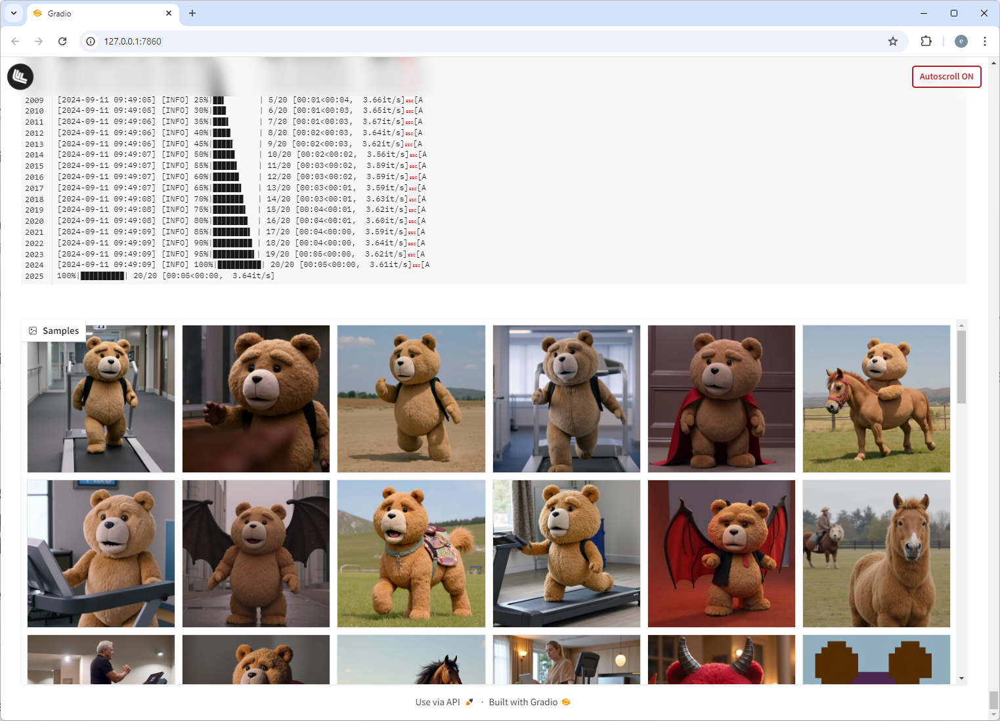
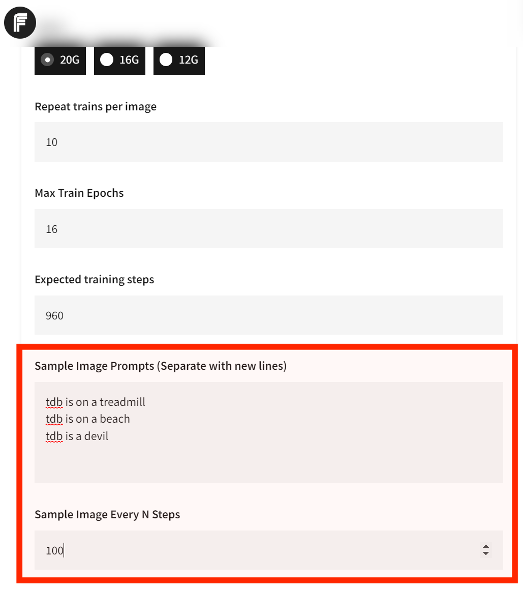
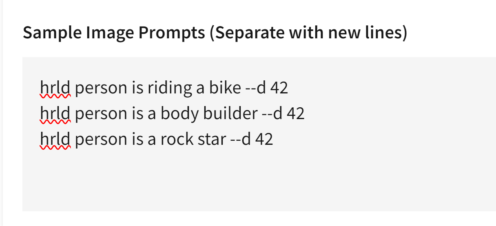
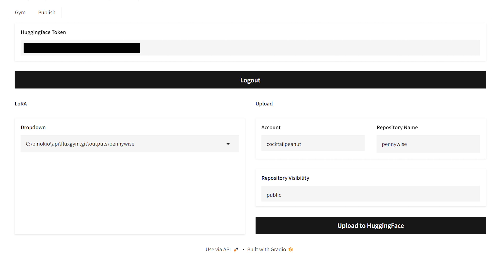
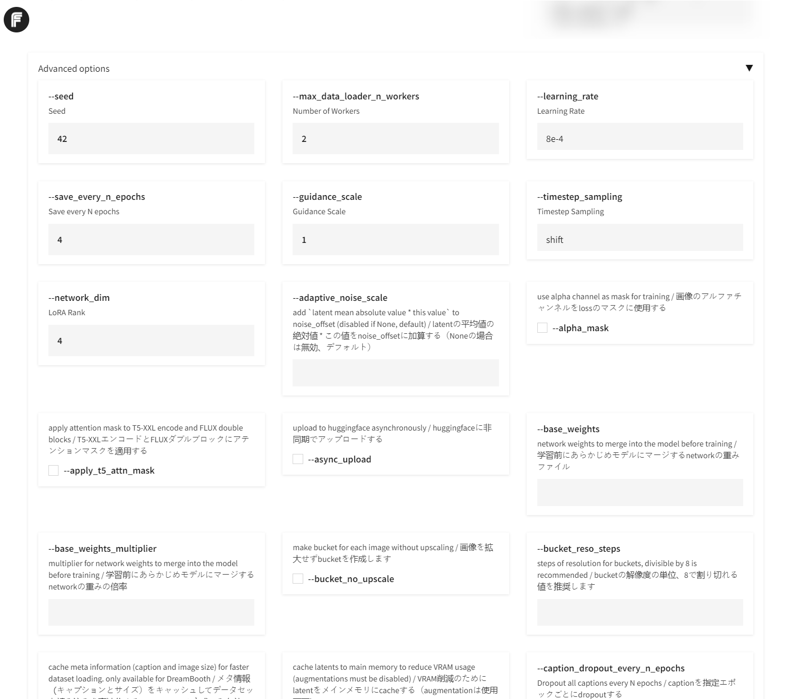

# FluxGym-R

Dead simple web UI for training FLUX LoRA on **AMD ROCm**, with **LOW VRAM (12GB/16GB/20GB/32GB) support.**

**FluxGym-R** is the ROCm edition of FluxGym: modern training status UI, live GPU telemetry, and AMD-first install scripts.

- **Frontend:** Gradio WebUI (forked from [AI-Toolkit](https://github.com/ostris/ai-toolkit) UI by https://x.com/multimodalart), redesigned for FluxGym-R
- **Backend:** Training powered by [Kohya Scripts](https://github.com/kohya-ss/sd-scripts)

FluxGym-R supports 100% of Kohya sd-scripts features through an [Advanced](#advanced) tab, which is hidden by default.

While training, the UI shows a centered status card (step, epoch, elapsed time, ETA, and current phase) plus a bottom-right GPU HUD (model, watts, VRAM). Raw logs stay in a collapsed Debug accordion.

---


# What is this?

FluxGym-R continues the great work behind FluxGym and extends the idea for AMD GPUs on ROCm, with a clearer live training view.

---


# Supported Models

1. Flux1-dev
2. Flux1-dev2pro (as explained here: https://medium.com/@zhiwangshi28/why-flux-lora-so-hard-to-train-and-how-to-overcome-it-a0c70bc59eaf)
3. Flux1-schnell (Couldn't get high quality results, so not really recommended, but feel free to experiment with it)
4. More?

The models are automatically downloaded when you start training with the model selected.

You can easily add more to the supported models list by editing the [models.yaml](models.yaml) file. If you want to share some interesting base models, please send a PR.

---

# Install

This fork targets **Ubuntu 24.04 LTS**. The installer auto-detects **AMD (ROCm)** vs **NVIDIA (CUDA)** and installs matching PyTorch **before** other requirements so pip does not pull the wrong wheel. Python 3.12 is the Ubuntu 24.04 default.

**AMD ROCm wheel selection** (when `ROCM_TORCH_INDEX` is unset):

| ROCm stack | PyTorch index | Notes |
|---|---|---|
| 10.x (or `ROCM_VERSION=10`) | `nightly/rocm10.0` | Nightly wheels until a stable `rocm10.0` index ships |
| 7.2 (default) | `rocm7.2` | Stable; used when ROCm is below 10 or version is unknown |
| Forced 7.x via `ROCM_VERSION=7.2` | `rocm7.2` | Explicit pin |

**NVIDIA CUDA wheel selection** (when `CUDA_TORCH_INDEX` is unset):

| Driver reports CUDA | PyTorch index | Notes |
|---|---|---|
| 12.8+ | `cu128` | Default for modern GPUs; required for RTX 50 / Blackwell |
| 12.6–12.7 | `cu126` | |
| 12.4–12.5 | `cu124` | |
| 12.1–12.3 | `cu121` | |
| 11.x | `cu118` | Older stacks |

Install system packages if needed:

```
sudo apt install python3 python3-venv python3-pip git
```

From the FluxGym-R repo root:

```
chmod +x install.sh install-rocm.sh app-launch.sh
./install.sh
```

Optional overrides:

```
# Force a backend
FORCE_GPU=rocm ./install.sh
FORCE_GPU=cuda ./install.sh

# Same as FORCE_GPU=rocm (auto-detect 7.2 vs 10)
./install-rocm.sh

# Force ROCm 10 PyTorch nightly wheels
ROCM_VERSION=10 ./install.sh
./install-rocm.sh 10

# Force stable ROCm 7.2 wheels
./install-rocm.sh 7.2

# Pin a specific wheel index
ROCM_TORCH_INDEX=https://download.pytorch.org/whl/nightly/rocm10.0 ./install.sh
CUDA_TORCH_INDEX=https://download.pytorch.org/whl/cu126 ./install.sh
```

The installer creates `env/`, pins `opencv-python==4.10.0.84` (avoids a Python 3.12 source-build failure), installs `sd-scripts` and FluxGym requirements, and writes `env/.fluxgym-gpu-backend` (plus `env/.fluxgym-rocm-index` on AMD) for `app-launch.sh`. If `sd-scripts` is already present, it is reused.

# Start

```
./app-launch.sh
```

On AMD and NVIDIA, training uses `torch.cuda` (`torch.cuda.is_available()` should be `True` when a GPU backend was installed).

## Install via Docker

First clone FluxGym-R and kohya-ss/sd-scripts:

```
git clone https://github.com/Yoink4CM/FluxGym-R
cd FluxGym-R
git clone -b sd3 https://github.com/kohya-ss/sd-scripts
```
Check your `user id` and `group id` and change it if it's not 1000 via `environment variables` of `PUID` and `PGID`. 
You can find out what these are in linux by running the following command: `id`

Now build the image and run it via `docker-compose`:
```
docker compose up -d --build
```

Open web browser and goto the IP address of the computer/VM: http://localhost:7860


# Configuration

## Sample Images

By default fluxgym doesn't generate any sample images during training.

You can however configure Fluxgym to automatically generate sample images for every N steps. Here's what it looks like:



To turn this on, just set the two fields:

1. **Sample Image Prompts:** These prompts will be used to automatically generate images during training. If you want multiple, separate teach prompt with new line.
2. **Sample Image Every N Steps:** If your "Expected training steps" is 960 and your "Sample Image Every N Steps" is 100, the images will be generated at step 100, 200, 300, 400, 500, 600, 700, 800, 900, for EACH prompt.



## Advanced Sample Images

Thanks to the built-in syntax from [kohya/sd-scripts](https://github.com/kohya-ss/sd-scripts?tab=readme-ov-file#sample-image-generation-during-training), you can control exactly how the sample images are generated during the training phase:

Let's say the trigger word is **hrld person.** Normally you would try sample prompts like:

```
hrld person is riding a bike
hrld person is a body builder
hrld person is a rock star
```

But for every prompt you can include **advanced flags** to fully control the image generation process. For example, the `--d` flag lets you specify the SEED.

Specifying a seed means every sample image will use that exact seed, which means you can literally see the LoRA evolve. Here's an example usage:

```
hrld person is riding a bike --d 42
hrld person is a body builder --d 42
hrld person is a rock star --d 42
```

Here's what it looks like in the UI:



And here are the results:


In addition to the `--d` flag, here are other flags you can use:


- `--n`: Negative prompt up to the next option.
- `--w`: Specifies the width of the generated image.
- `--h`: Specifies the height of the generated image.
- `--d`: Specifies the seed of the generated image.
- `--l`: Specifies the CFG scale of the generated image.
- `--s`: Specifies the number of steps in the generation.

The prompt weighting such as `( )` and `[ ]` also work. (Learn more about [Attention/Emphasis](https://github.com/AUTOMATIC1111/stable-diffusion-webui/wiki/Features#attentionemphasis))

## Publishing to Huggingface

1. Get your Huggingface Token from https://huggingface.co/settings/tokens
2. Enter the token in the "Huggingface Token" field and click "Login". This will save the token text in a local file named `HF_TOKEN` (All local and private).
3. Once you're logged in, you will be able to select a trained LoRA from the dropdown, choose public or private visibility, edit the name if you want, and publish to Huggingface.




## Advanced

The advanced tab is automatically constructed by parsing the launch flags available to the latest version of [kohya sd-scripts](https://github.com/kohya-ss/sd-scripts). This means Fluxgym is a full fledged UI for using the Kohya script.

> By default the advanced tab is hidden. You can click the "advanced" accordion to expand it.




## Advanced Features

### Uploading Caption Files

You can also upload the caption files along with the image files. You just need to follow the convention:

1. Every caption file must be a `.txt` file.
2. Each caption file needs to have a corresponding image file that has the same name.
3. For example, if you have an image file named `img0.png`, the corresponding caption file must be `img0.txt`.
